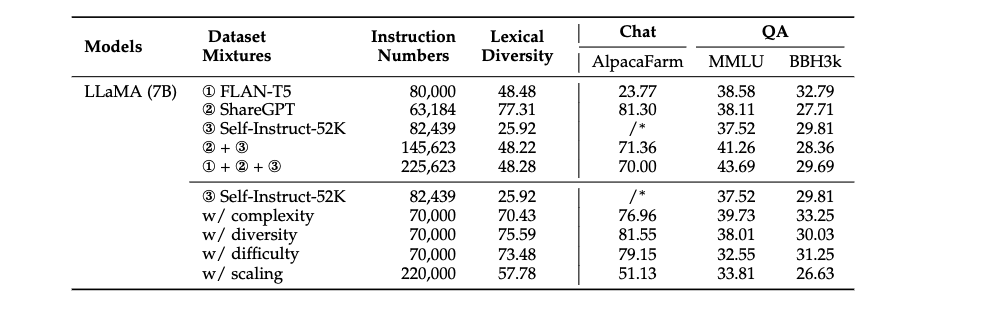
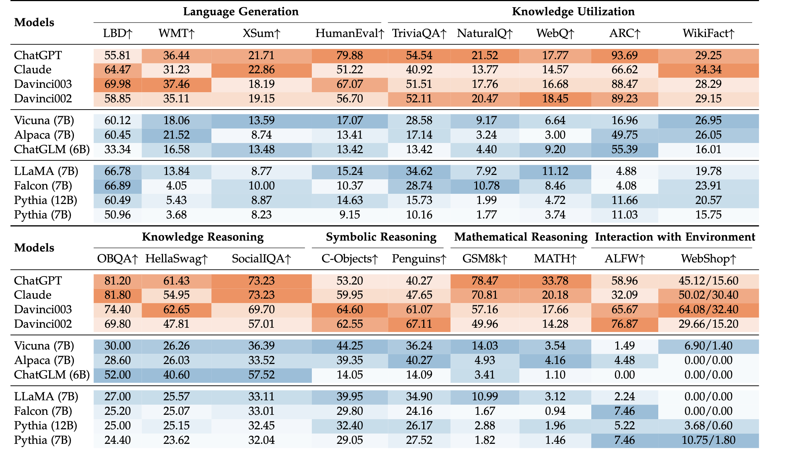
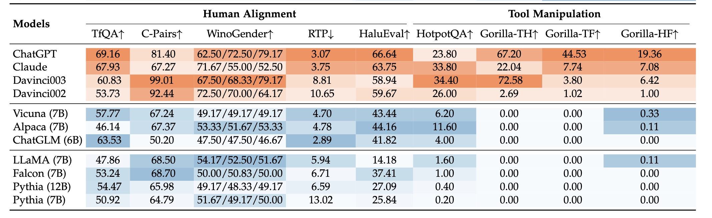

# Experiments

> To reproduce our experiments, we publicly release our experimental code and data here accorrding to correponding ability.
>
> **We also call for support of computing power for conducting more comprehensive experiments.**

## Code and data

- Language Generation  [experiments](LanguageGeneration).
- Knowledge Utilization  [experiments](KnowledgeUtilization).
- Knowledge Reasoning  [experiments](KnowledgeUtilization).
- Symbolic Reasoning  [experiments](SymbolicReasoning).
- Mathematical Reasoning  [experiments](MathematicalReasoning).
- Human Alignment  [experiments](HumanAlignment).
- Tool Manipulation  [experiments](ToolManipulation).
- Knowledge Reasoning [experimets.](KnowledgeReasoning)

## Results

### Instruction Tuning Experiments Results

Here is the results of instruction-tuning experiments (all in a single-turn conversation) based on the LLaMA (7B) model under the chat and QA setting. We employ four instruction improvement strategies on the Self-Instruct-52K dataset, i.e., enhancing the complexity (w/ complexity), increasing the diversity (w/ diversity), balancing the difficulty (w/ difficulty), and scaling the instruction number (w/ scaling). ∗Since we select the LLaMA-7B model fine-tuned on Self-Instruct-52K as the baseline, we omit the win rate of the fine-tuned model with Self-Instruct-52K against itself.

### Ability Evaluaition Experiments Results

Here is the results of evaluation on the eight abilities of LLMs with specially selected tasks. The shade of the Orange and Blue fonts denote the performance orders of the results in closed-source and open-source models, respectively. This table will be continuously updated by incorporating the results of more models.

